# NovoPay — Secure Three-Tier Banking Application on AWS

> A full-stack digital banking application deployed on AWS with a Flask backend on EC2, RDS MySQL database in a private subnet, and an Application Load Balancer with SSL termination — implementing defense-in-depth security across a custom VPC architecture.

**Live Site:** [novo.codeandcloud.site](https://novo.codeandcloud.site)

---

## Overview

NovoPay is a production-grade banking application demonstrating a three-tier AWS architecture:

1. **Presentation tier** — HTML/CSS/JavaScript frontend served by Flask
2. **Application tier** — Flask backend on EC2 in a public subnet handling all business logic
3. **Data tier** — RDS MySQL database isolated in a private subnet with no public internet access

The project demonstrates real-world cloud infrastructure practices — custom VPC networking, security group chaining, SSL termination via ALB, Linux service management, and secure credential handling.

---

## Architecture

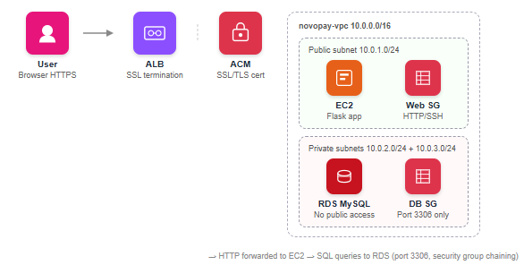

---

## AWS Services Used

| Service | Purpose |
|---|---|
| **VPC** | Custom isolated network with CIDR 10.0.0.0/16 |
| **Subnets** | Public subnet for EC2, private subnets for RDS across 2 AZs |
| **Internet Gateway** | Entry point connecting VPC to the internet |
| **Route Table** | Routes internet-bound traffic through IGW — associated with public subnet only |
| **Security Groups** | Three-layer firewall — ALB SG, Web SG, DB SG |
| **EC2** | Virtual server running Flask application (Amazon Linux 2023, t3.micro) |
| **RDS MySQL** | Managed database in private subnet — no public internet access |
| **ALB** | Application Load Balancer handling SSL termination and HTTP→HTTPS redirect |
| **ACM** | SSL/TLS certificate for novo.codeandcloud.site |
| **Elastic IP** | Static public IP address for EC2 instance |
| **IAM** | Execution roles and access policies |

---

## Security Architecture — Defense in Depth

Security is implemented at multiple layers:

### Security Group Chaining

```
Internet
    ↓ HTTPS/HTTP
ALB Security Group (novopay-alb-sg)
    → Allows: HTTP port 80, HTTPS port 443 from 0.0.0.0/0

    ↓ HTTP port 80
Web Server Security Group (novopay-web-sg)
    → Allows: HTTP port 80 from novopay-alb-sg ONLY
    → Allows: SSH port 22 (admin access)

    ↓ MySQL port 3306
Database Security Group (novopay-db-sg)
    → Allows: MySQL port 3306 from novopay-web-sg ONLY
    → Blocks: ALL direct internet access
```

### Additional Security Measures

- **Private subnet isolation** — RDS has no public IP and no internet route
- **HTTPS enforcement** — ALB redirects 100% of HTTP traffic to HTTPS automatically
- **SSL/TLS termination** — ACM certificate handles encryption at the ALB layer
- **Zero hardcoded credentials** — database credentials stored in `/etc/novopay.env` as Linux environment variables, never in source code or version control

---

## Application Features

- **User authentication** — login with username and PIN verified against RDS
- **Account dashboard** — real-time balance and transaction history from database
- **Fund transfers** — transfer between accounts with persistent RDS updates
- **Loan requests** — request loans with eligibility check against transaction history
- **Account closure** — permanently delete account and transaction history from RDS
- **Auto logout** — 10-minute inactivity timer
- **Data persistence** — all operations survive page refresh (stored in RDS, not browser memory)

---

## Tech Stack

- **Frontend:** HTML5, CSS3, JavaScript (ES6+)
- **Backend:** Python 3, Flask, boto3, pymysql
- **Database:** MySQL (AWS RDS)
- **Cloud:** AWS VPC, EC2, RDS, ALB, ACM, IAM, Elastic IP, Security Groups
- **Linux:** Amazon Linux 2023, systemd, yum, SSH
- **DNS:** Hostinger (CNAME → ALB)
- **Version Control:** Git, GitHub

---

## Database Schema

**accounts table**
```sql
id INT AUTO_INCREMENT PRIMARY KEY
owner VARCHAR(100)
username VARCHAR(50) UNIQUE
pin INT
interest_rate FLOAT
currency VARCHAR(10)
locale VARCHAR(20)
balance FLOAT DEFAULT 0
```

**transactions table**
```sql
id INT AUTO_INCREMENT PRIMARY KEY
account_id INT (FOREIGN KEY → accounts.id)
amount FLOAT
type VARCHAR(20)
created_at TIMESTAMP DEFAULT CURRENT_TIMESTAMP
```

---

## Flask API Endpoints

| Endpoint | Method | Description |
|---|---|---|
| `/` | GET | Serves frontend HTML |
| `/login` | POST | Authenticates user, returns account data |
| `/transfer` | POST | Transfers funds between accounts |
| `/loan` | POST | Processes loan request |
| `/close` | POST | Permanently deletes account |

---

## Linux Server Setup

Flask runs as a systemd service — auto-starts on boot, auto-restarts on crash:

```bash
# Service file: /etc/systemd/system/novopay.service
[Unit]
Description=NovoPay Flask Application
After=network.target

[Service]
User=root
WorkingDirectory=/home/ec2-user
EnvironmentFile=/etc/novopay.env
ExecStart=/usr/bin/python3 /home/ec2-user/app.py
Restart=always

[Install]
WantedBy=multi-user.target
```

```bash
sudo systemctl start novopay
sudo systemctl enable novopay
sudo systemctl status novopay
```

---

## Screenshots

### VPC & Networking

**Custom VPC**
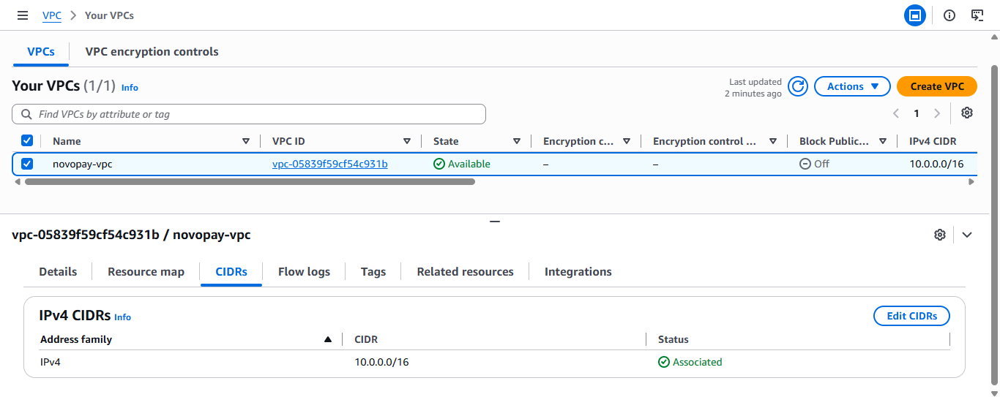

**Subnets — Public and Private**
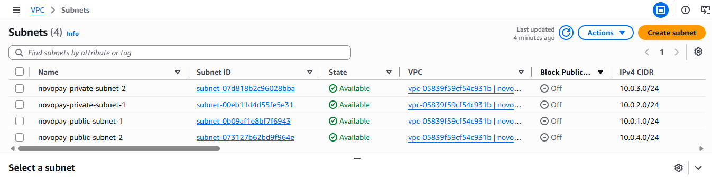

**Internet Gateway**
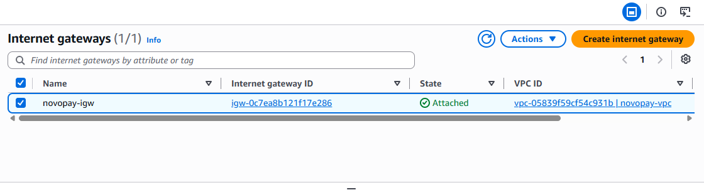

**Route Table**
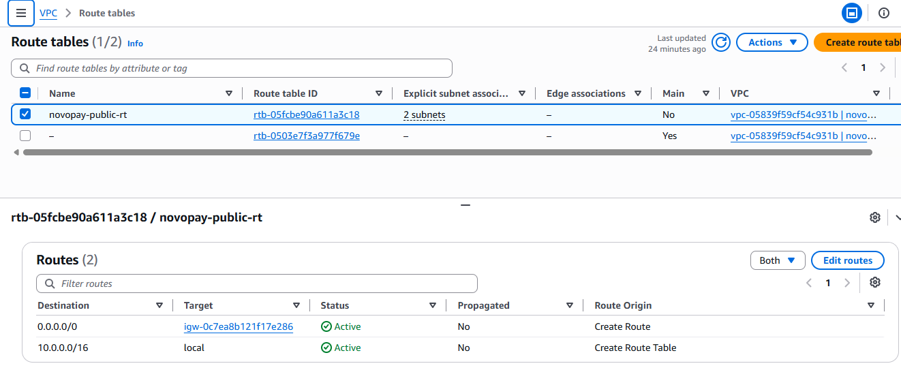

**Security Group Chaining**
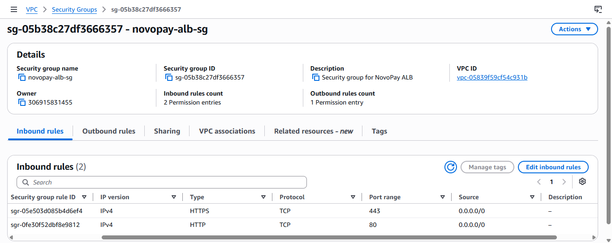
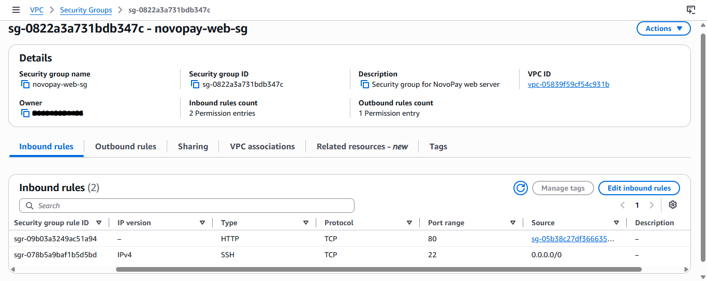
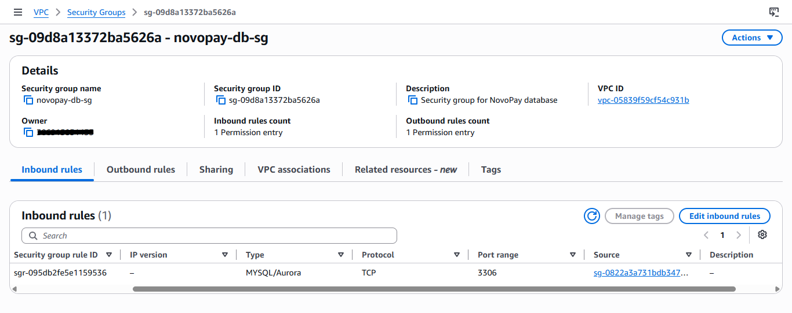

### Compute & Database

**EC2 Instance**
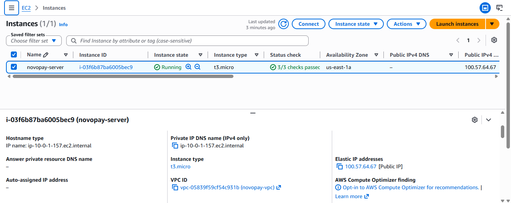

**Elastic IP**
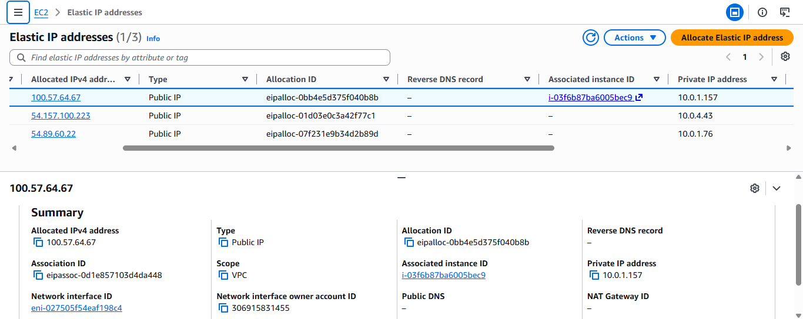

**RDS — No Public Access**
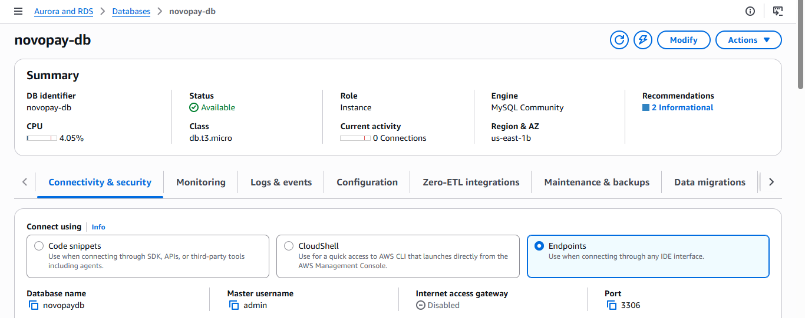

### Load Balancer & SSL

**Application Load Balancer**
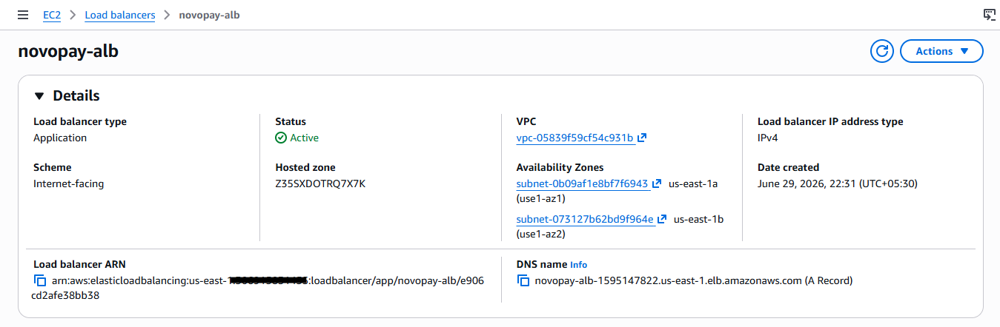
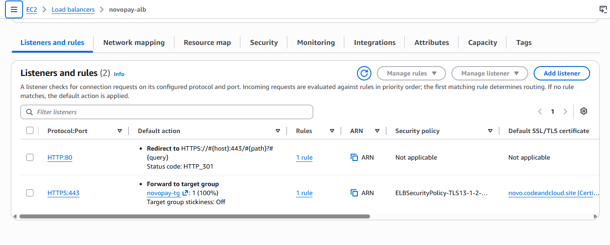

**Target Group — Healthy**
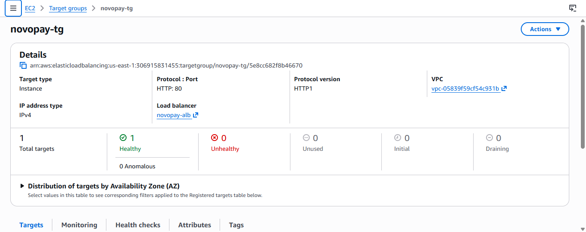

**ACM Certificate — Issued**
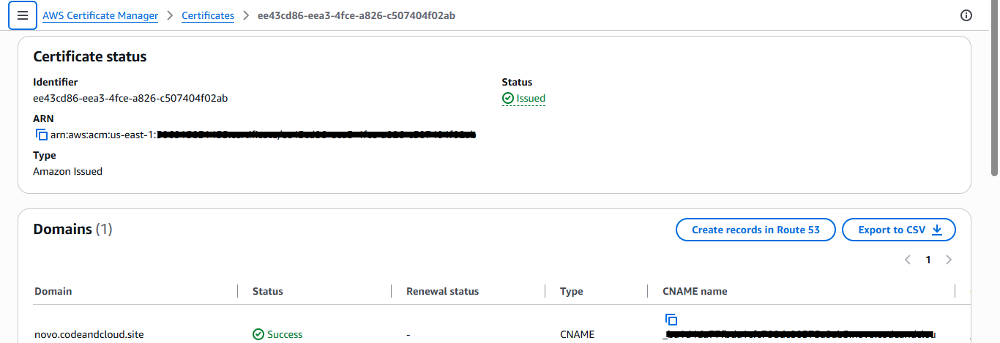

### Linux Service

**systemd Service — Active**
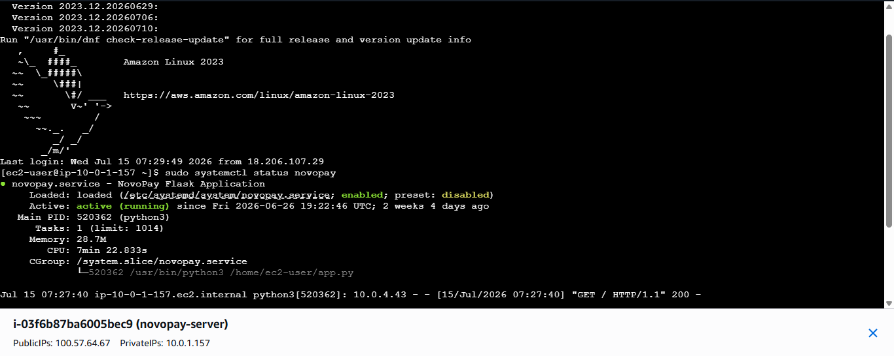

### Live Application

**Login Page with HTTPS**
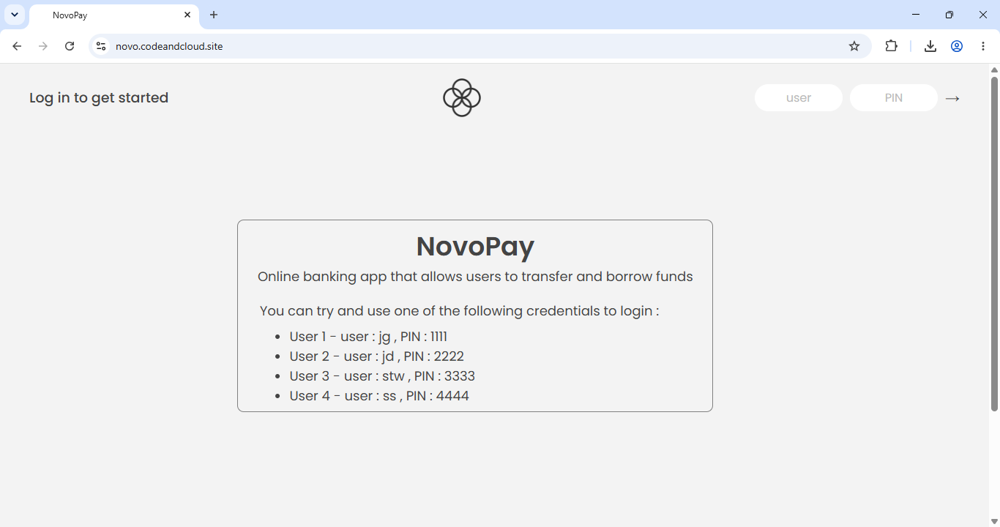

**Connection Secure**
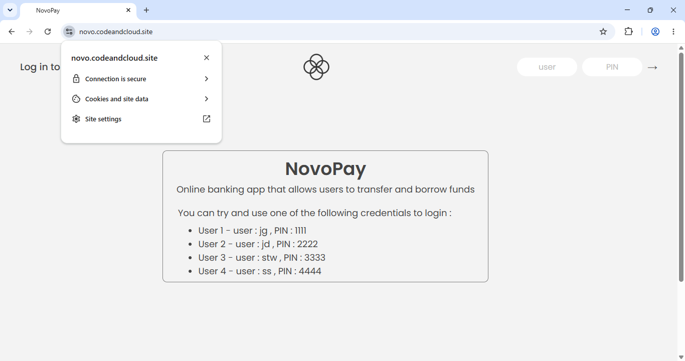

**Dashboard**
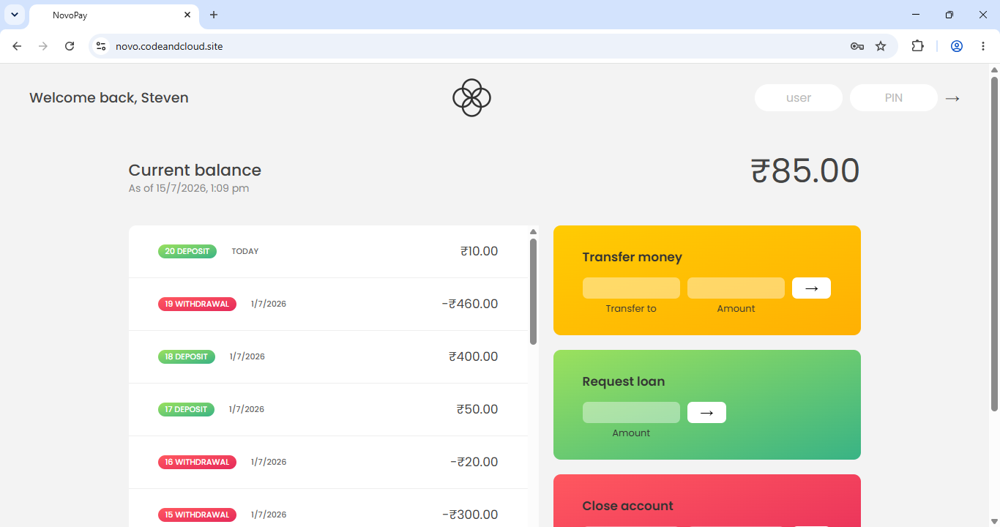

**Transfer Money**


**Request Loan**
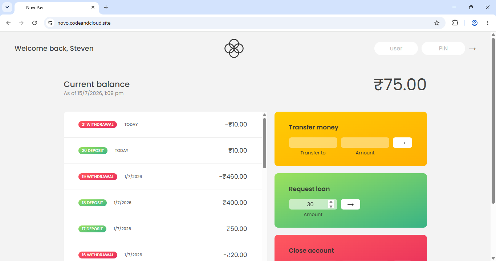

**Successful Transactions**
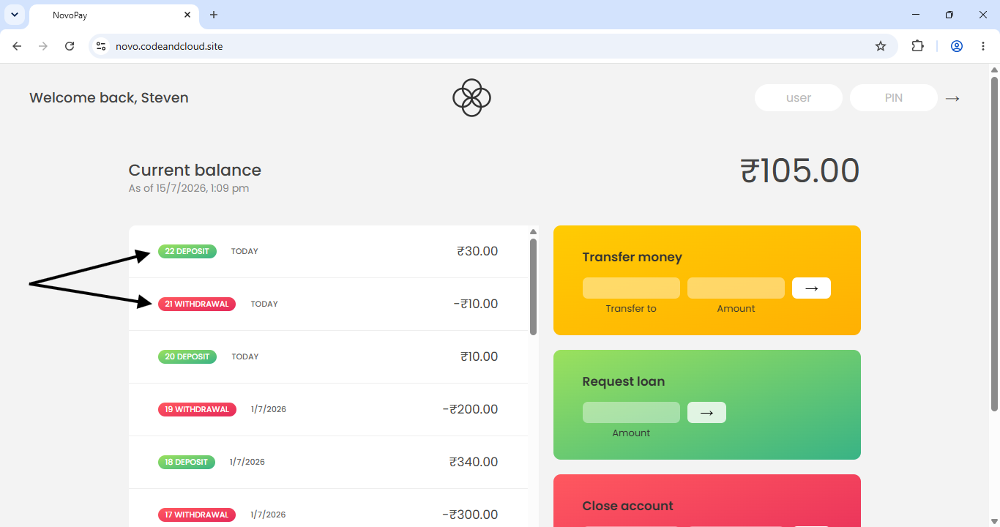

---

## Key Architecture Decisions

**Why custom VPC over default?**
Building each networking component manually — subnets, Internet Gateway, route tables, security groups — provides full understanding of what breaks when any layer is misconfigured. This is essential for cloud support and troubleshooting roles where you debug infrastructure issues at the service level.

**Why RDS in private subnet?**
Databases should never be directly accessible from the internet. By placing RDS in a private subnet with no internet route, the database is unreachable from outside the VPC regardless of any other configuration. The only path to the database is through the application layer — enforced by security group chaining.

**Why ALB over direct EC2 access?**
ALB enables SSL termination via ACM — you cannot attach an ACM certificate directly to an EC2 instance. ALB also provides health checks, multi-AZ availability, and a clean separation between the public internet and the application server.

**Why systemd over manual Flask startup?**
Running `python3 app.py` manually stops when the terminal closes or the server reboots. A systemd service runs continuously in the background, starts automatically on every EC2 boot, and restarts automatically if Flask crashes — this is how production applications are actually managed on Linux servers.

**Why environment variables for credentials?**
Hardcoding database credentials in source code is a critical security risk — anyone with access to the code (including GitHub) would see the password. Storing them in `/etc/novopay.env` keeps sensitive values out of version control entirely.

---

## Author

**Geethu P R** — [GitHub](https://github.com/geeth34/) | [LinkedIn](https://linkedin.com/in/geethupr/)
